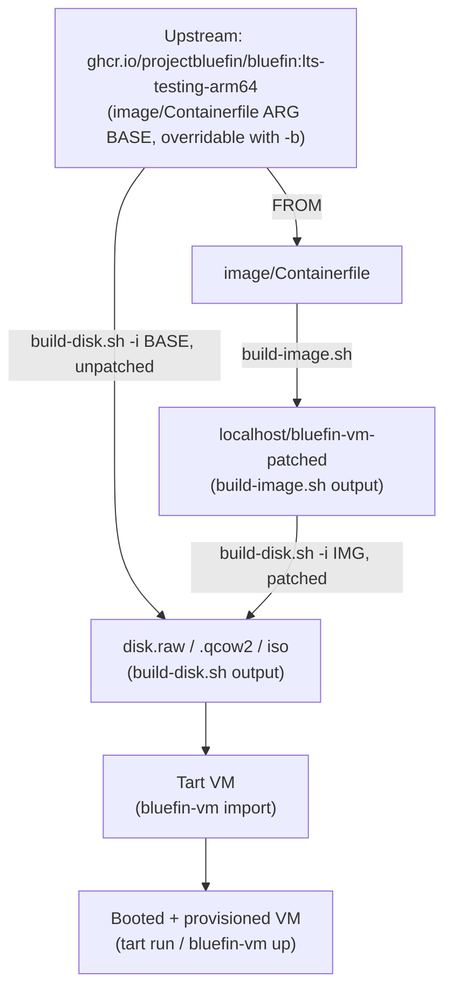
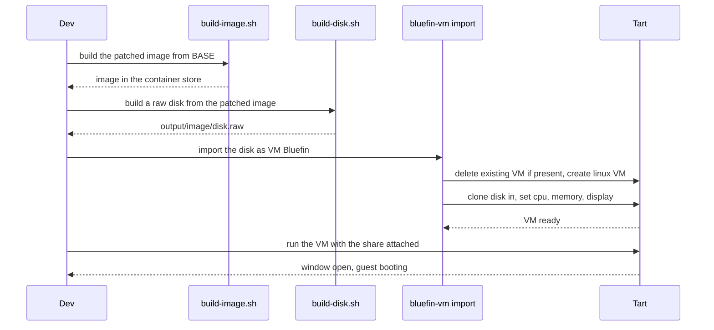

# diagrams — the build and boot flows

Mermaid diagrams of what the scripts and the `bluefin-vm` CLI actually do,
stage by stage, including the decisions each one makes. Each file covers one
flow; read `docs/content/just/build.md` and `docs/PROVISIONING.md` for the prose
version of the same ground.

- [`image-build.md`](image-build.md) — `bin/build-image.sh`: `image/Containerfile`
  into a `localhost/` image.
- [`disk-build.md`](disk-build.md) — `bin/build-disk.sh`: an image into a
  bootable disk.
- [`vm-import.md`](vm-import.md) — `bluefin-vm import`: a disk into a Tart VM.
- [`vm-up.md`](vm-up.md) — `bluefin-vm up`: the disk pipeline plus first-boot
  provisioning, end to end.
- [`states.md`](states.md) — the three boot states (unpatched / patched /
  provisioned), each built by one step (config.toml → Containerfile →
  provisioning), and what each gives you.

## How the pieces chain

`image/Containerfile`'s `FROM` is the same upstream image `build-disk.sh` can
also consume directly — layering the Containerfile first (patching) is
optional, not a required step in the chain:

## A full local build, in order

The sequence a fresh `just tart up-patched` actually runs -- build the patched
image, build a disk from it, import into Tart, then start it:

`bluefin-vm up` (see [`vm-up.md`](vm-up.md)) covers the same ground plus
downloading a published disk instead of building one, and first-boot
provisioning.
