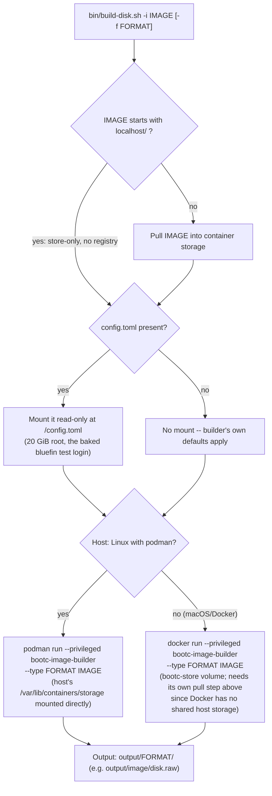

# disk build — `bin/build-disk.sh`

Turns a container image -- upstream, or the patched `localhost/` image from
`image-build.md` -- into a bootable disk via `bootc-image-builder`. Same
entrypoint locally (Docker/Colima) and in CI (`ubuntu-24.04-arm`, Podman
pre-installed): `.github/workflows/build-arm-image.yml` just calls this
script with its inputs as flags.

`FORMAT` is one of `raw` (what Tart imports), `qcow2` (thin-provisioned,
generic), `iso` (installer), or `vmdk`. On Linux the Podman path needs
rootful storage for loop devices (run via `sudo`); on macOS, Colima needs
headroom (`colima start --cpu 4 --memory 8`) and ~20 GB free disk for a raw
build.
