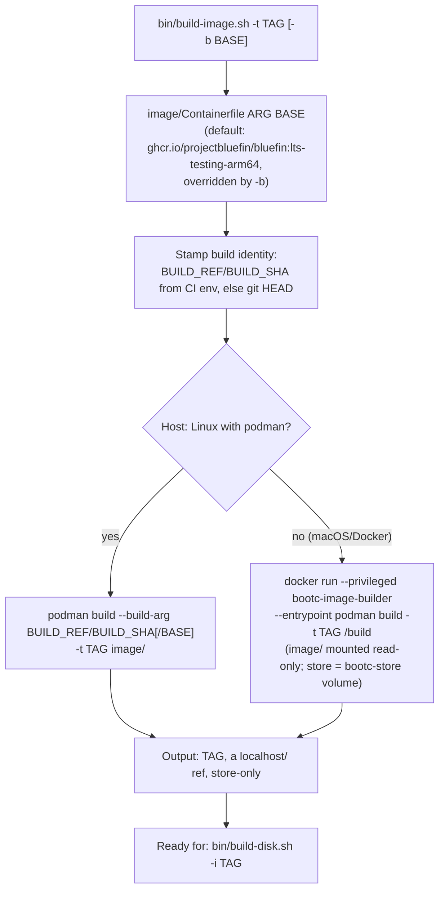

# image build — `bin/build-image.sh`

Layers `image/Containerfile` onto its upstream base and lands the result in
the container store as a `localhost/` ref (never pushed anywhere) --
store-only, so `build-disk.sh` skips pulling it.

`-b BASE` overrides the Containerfile's own default, so the patched layer
tracks whichever upstream image the caller configured. On Linux the Podman
path needs rootful storage (run via `sudo`, same as `build-disk.sh`).
