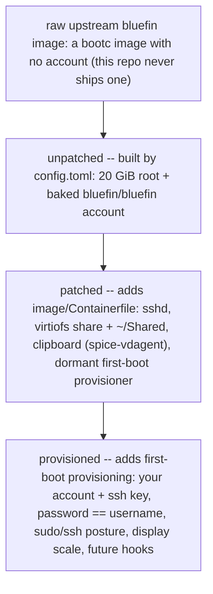

# states — what a booted VM gives you

A disk this repo builds boots into one of three states, each adding to the one before. Which you get depends on how the
disk was built and whether the host provisioned it. Each state is produced by exactly one build step, so there's a
single name for each (no separate "layer" vs "state" numbering) — the step that adds it is just a column below.

| State           | Built by                     | How you reach it                                                 | Login                                                                           | What it adds                                                                   |
| --------------- | ---------------------------- | ---------------------------------------------------------------- | ------------------------------------------------------------------------------- | ------------------------------------------------------------------------------ |
| **unpatched**   | `config.toml` (every build)  | `just tart up`                                                   | `bluefin` / `bluefin`, in `wheel` (console or greeter)                          | just boots; no ssh, share, clipboard, or provisioner                           |
| **patched**     | + `image/Containerfile`      | `just tart up-patched`; the published seed with `--no-provision` | `bluefin` / `bluefin`, in `wheel` (unchanged — patched adds no account)         | sshd, the host share (`~/Shared`), clipboard, a dormant first-boot provisioner |
| **provisioned** | + provisioning at first boot | `just tart up-provisioned`; `bluefin-vm up`                      | your account, in `wheel` — `user` / `user` at the greeter (see PROVISIONING.md) | ssh key, `password == username`, the sudo/ssh posture, display scale           |

Notes that trip people up:

- **`bluefin` comes from the unpatched state (`config.toml`)**, so it exists in all three; in *provisioned* you log into
    your own account, but `bluefin` is still there underneath. It's a `wheel` account, so it can `sudo` — with its
    (known, `bluefin`) password. The passwordless-sudo drop-in is never `bluefin`'s; it only ever goes to the
    provisioned account, and only when that toggle is on.
- **The published seed is already patched.** `bluefin-vm up` downloads it and provisions on top (patched → provisioned).
    `just tart up`, by contrast, builds *unpatched* straight from the upstream image.
- **A login-less image** is only the raw upstream bootc image with no `config.toml` — this repo never builds one.
