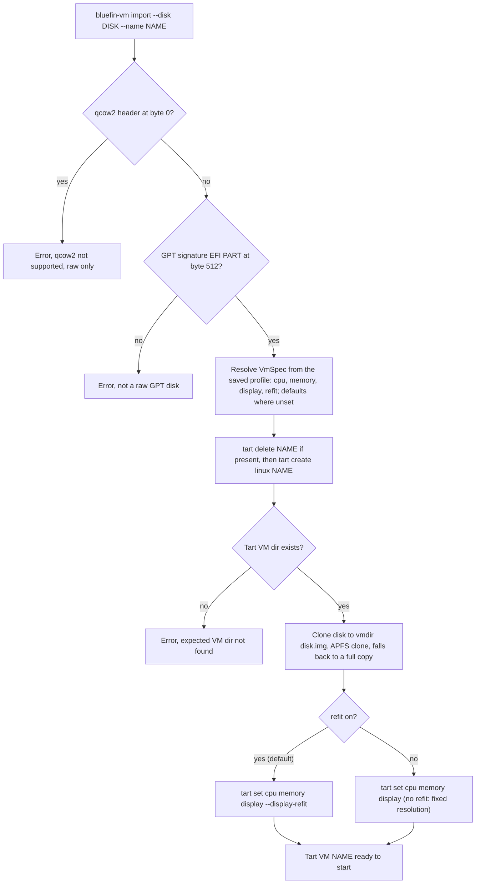

# VM import — `bluefin-vm import`

Imports a built disk into a Tart VM, replacing the VM if it exists. One
implementation, in `cli/src/core/tart.rs`; the `just tart import` / `up`
recipes call it rather than reimplementing it. The input must be a raw GPT
disk (identified by content, not filename), and it's validated *before* the
destructive delete+recreate — a bad input must never cost a working VM.

Resources come solely from the VM's saved profile (`bluefin-vm tui`); the
built-in defaults are 4 vCPUs, 4096 MiB, a 1920×1200 display, and refit on.
With refit on, `--display-refit` lets the guest resolution follow the Tart
window; with it off, the display stays fixed, which is what lets a chosen
resolution and guest scale hold (the scale itself is applied guest-side at
first boot — see [`vm-up.md`](vm-up.md)).
