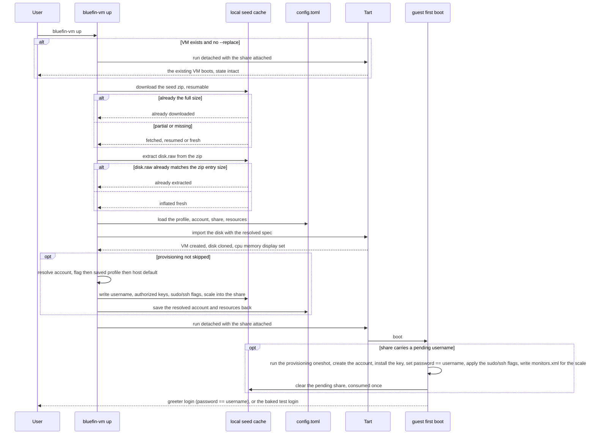

# `bluefin-vm up` — the end-to-end pipeline

The one command that brings the VM up. An existing VM holds the user's state,
so it simply boots; the pipeline — download → extract → import → provision →
run — runs when the VM is missing or `--replace` asks for a fresh one. Each
pipeline step is also its own subcommand
(`bluefin-vm download`/`extract`/`import`/`provision`) for debugging; `up`
chains them with the skip-if-already-done checks each step owns.

Precedence throughout is **flag > saved profile > built-in default** (`up`'s
own flags, or a VM's profile from `bluefin-vm tui`). Provisioning happens on a
fresh VM's first boot only, so account and resource changes in the profile
apply through `up --replace`; the share settings are passed on every boot and
follow the profile immediately.
